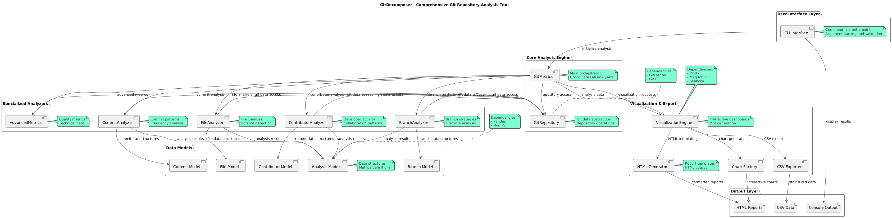

# GitDecomposer 

A comprehensive Python toolkit for analyzing Git repositories. GitDecomposer provides detailed insights into commit patterns, contributor behavior, file changes, branch strategies, and overall repository health through an intuitive class-based API and interactive visualizations.


## Features

- **Comprehensive Analysis**: Analyze commits, contributors, files, and branches
- **Interactive Visualizations**: Generate HTML dashboards with interactive charts
- **Multiple Output Formats**: Export data as CSV files or HTML reports
- **Modular Design**: Use individual analyzers or the complete metrics suite
- **CLI Interface**: Command-line tool for quick analysis
- **Extensible Architecture**: Well-structured classes for custom analysis

## Quick Start

### Installation

```bash
# Clone the repository
git clone https://github.com/Heydarchi/GitDecomposer.git
cd GitDecomposer

# Create virtual environment (recommended)
python -m venv gitdecomposer-env

# Activate virtual environment
# Windows:
gitdecomposer-env\Scripts\activate
# macOS/Linux:
# source gitdecomposer-env/bin/activate

# Install in development mode
pip install -e .
```

### Basic Usage

```python
from gitdecomposer import GitRepository, GitMetrics
from gitdecomposer.services import DataAggregator, DashboardGenerator, ReportGenerator, ExportService

# Initialize repository
repo = GitRepository("/path/to/your/git/repository")

# Option 1: Use the simplified GitMetrics interface (recommended for most users)
metrics = GitMetrics(repo)
summary = metrics.generate_repository_summary()
print(f"Total commits: {summary['commits']['total_commits']}")

# Create comprehensive dashboard and export
metrics.create_comprehensive_dashboard()

# Option 2: Use individual services for fine-grained control
data_aggregator = DataAggregator(repo)
dashboard_generator = DashboardGenerator(data_aggregator)
report_generator = ReportGenerator(dashboard_generator)
export_service = ExportService(data_aggregator)

# Generate specific analyses
repo_summary = data_aggregator.get_repository_summary()
enhanced_summary = data_aggregator.get_enhanced_repository_summary()

# Create targeted visualizations
dashboard_generator.create_commit_activity_dashboard("commit_analysis.html")
dashboard_generator.create_contributor_analysis_charts("contributor_analysis.html")

# Generate comprehensive reports with navigation
report_generator.generate_all_reports("./reports")

# Export data to CSV with organized structure
export_service.export_metrics_to_csv("./csv_data")
```

### Command Line Interface

```bash
# Analyze current directory
gitdecomposer .

# Analyze specific repository
gitdecomposer /path/to/repository

# Specify output directory
gitdecomposer /path/to/repository --output ./my_analysis
```

**Alternative: Direct script execution:**

```bash
# For development/testing
python gitdecomposer/cli.py /path/to/repository --output ./analysis_output
```

## Examples

See the [`examples/`](examples/) directory for detailed usage examples:

- **[Basic Analysis](examples/basic_analysis.py)** - Simple repository analysis
- **[Advanced Analysis](examples/advanced_analysis.py)** - Using individual analyzers  
- **[Comprehensive Analysis](examples/comprehensive_analysis.py)** - Full-featured analysis
- **[Enhanced Analytics](examples/enhanced_analytics.py)** - Advanced metrics and visualizations
- **[Advanced Reporting Demo](examples/advanced_reporting_demo.py)** - Comprehensive reporting features

## Architecture

See the [Architecture Diagram](docs/architecture.puml) for system design and component relationships.



## Documentation

For detailed documentation, see:
- **[Documentation](docs/README.md)** - Complete guide and API reference
- **[Examples README](examples/README.md)** - Example usage patterns

## Testing

The project includes a comprehensive test suite with high coverage:

```bash
# Run all tests
python -m pytest tests/ -v

# Run specific test categories
python -m pytest tests/test_service_integration.py -v  # Service integration tests
python -m pytest tests/test_data_aggregator.py -v     # Data aggregation tests
python -m pytest tests/test_report_generator.py -v    # Report generation tests
python -m pytest tests/test_export_service.py -v      # Export functionality tests

# Run with coverage report
python -m pytest tests/ --cov=gitdecomposer --cov-report=html

# Run specific test file (legacy)
python tests/run_tests.py
```

### Test Coverage

The test suite covers:
- **Service Integration**: End-to-end service interaction testing
- **Data Aggregation**: Repository summary and data consolidation
- **Dashboard Generation**: Visualization and chart creation
- **Report Generation**: HTML report creation and navigation
- **Export Services**: CSV export and data serialization
- **Error Handling**: Graceful degradation and error recovery
- **Performance**: Large dataset handling and memory efficiency

## Development

### Code Quality

```bash
# Check code formatting and style
source scripts/check_lint.sh

# Auto-fix formatting issues
source scripts/fix_lint.sh
```

### Project Structure

```
GitDecomposer/
├── gitdecomposer/          # Main package
│   ├── analyzers/          # Analysis modules
│   ├── core/              # Core functionality (GitRepository)
│   ├── models/            # Data models and structures
│   ├── services/          # Service layer (DataAggregator, DashboardGenerator, etc.)
│   └── viz/               # Visualization components
├── examples/              # Usage examples
├── tests/                 # Comprehensive test suite
├── docs/                  # Documentation and architecture
└── scripts/               # Development scripts
```

## Architecture

The project follows a **service-oriented architecture** with clear separation of concerns:

- **Core Layer**: `GitRepository` for Git operations
- **Analysis Layer**: Specialized analyzers for different data types
- **Service Layer**: 
  - `DataAggregator`: Consolidates data from analyzers
  - `DashboardGenerator`: Creates interactive visualizations
  - `ReportGenerator`: Generates comprehensive HTML reports
  - `ExportService`: Handles CSV and data export
  - `AdvancedAnalytics`: Advanced metrics and forecasting
- **Interface Layer**: `GitMetrics` (simplified API) and CLI

See the [Architecture Diagram](docs/architecture.puml) for detailed system design.

## License

This project is licensed under the Apache 2.0 License - see the [LICENSE](LICENSE) file for details.

## Contributing

1. Fork the repository
2. Create a feature branch (`git checkout -b feature/amazing-feature`)
3. Make your changes
4. Run tests (`python -m pytest tests/ -v`)
5. Run linting (`source scripts/check_lint.sh`)
6. Commit your changes (`git commit -m 'Add amazing feature'`)
7. Push to the branch (`git push origin feature/amazing-feature`)
8. Open a Pull Request
